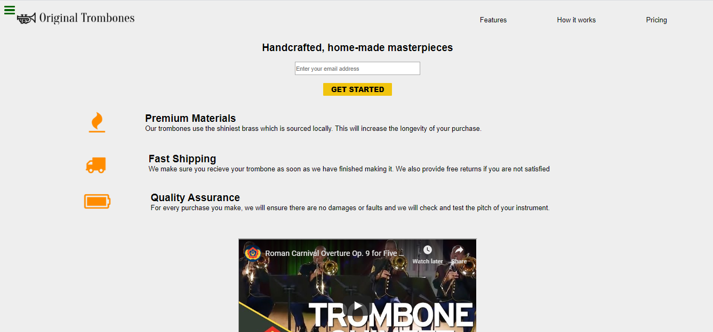

# Landing-page

> FCC: Product Landing Page Web responsive clone

## Built With

- Html5,
- CSS3

## Live Demo
 [Live Demo](https://raw.githack.com/nellencr/Landing-page/feature/index.html)

👤 **Author**

- Github: [@nellencr](https://github.com/nellencr)
- Twitter: [Nella](https://twitter.com/Nella75794271)
- Linkedin: [Nela Komane](https://www.linkedin.com/in/nela-komane-8866b9192/)

## 🤝 Contributing

Contributions, issues and feature requests are welcome! Start by:
*Forking the project
*Cloning the project to your local machine
*`cd` into the project directory
*Run `git checkout -b your-branch-name`
*Make your contributions
*Push your branch up to your forked repository
*Open a Pull Request with a detailed description to the development branch of the original project for a review
